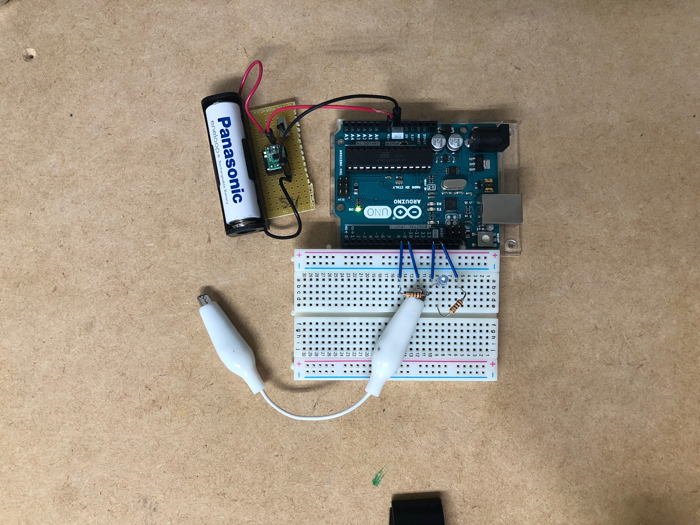
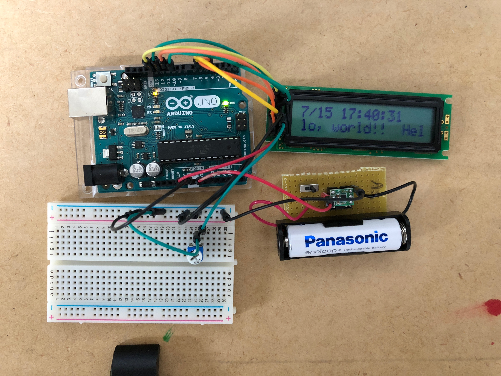
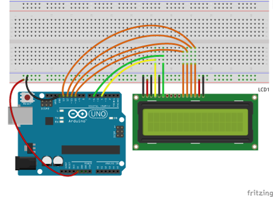

# Table of Contents

<!-- MarkdownTOC autolink="true" autoanchor="true" indent="    " -->

- [タッチセンサ](#%E3%82%BF%E3%83%83%E3%83%81%E3%82%BB%E3%83%B3%E3%82%B5)
    - [hardware configure](#hardware-configure)
    - [code](#code)
        - [simple threshold](#simple-threshold)
        - [low-pass filter](#low-pass-filter)
    - [references](#references)
        - [マルチタッチパネル](#%E3%83%9E%E3%83%AB%E3%83%81%E3%82%BF%E3%83%83%E3%83%81%E3%83%91%E3%83%8D%E3%83%AB)
        - [タッチセンサ](#%E3%82%BF%E3%83%83%E3%83%81%E3%82%BB%E3%83%B3%E3%82%B5-1)
- [Time](#time)
    - [setup](#setup)
    - [code](#code-1)
    - [references](#references-1)
- [LCD](#lcd)
    - [hardware configure](#hardware-configure-1)
    - [code](#code-2)
        - [simple lcd](#simple-lcd)
        - [lcd change](#lcd-change)
        - [lcd time](#lcd-time)
    - [references](#references-2)
        - [LCD 1602B SC1602BSLB](#lcd-1602b-sc1602bslb)
        - [LCD 1602A](#lcd-1602a)
- [ホールセンサー](#%E3%83%9B%E3%83%BC%E3%83%AB%E3%82%BB%E3%83%B3%E3%82%B5%E3%83%BC)
    - [A1324LUA-T](#a1324lua-t)
        - [code](#code-3)
            - [simple analog-input](#simple-analog-input)
            - [convert to gauss](#convert-to-gauss)
    - [references](#references-3)

<!-- /MarkdownTOC -->


---
<!-- ############################################################################## -->
<!-- ############################################################################## -->
<a id="%E3%82%BF%E3%83%83%E3%83%81%E3%82%BB%E3%83%B3%E3%82%B5"></a>
# タッチセンサ

<!-- ############################################################################## -->
<a id="hardware-configure"></a>
## hardware configure


<!-- ############################################################################## -->
<a id="code"></a>
## code

<!-- ############################################################################## -->
<a id="simple-threshold"></a>
### simple threshold 

[](https://www.youtube.com/watch?v=SQEXNxOh0jY)

Vinに電池で5Vをいれるとthreshold fに関するの条件を`2よりも大きい`にしなければ動かなかった.   
電池の場合はノイズが少ないとかで処理にもう少し手をいれる必要があるのかもしれないので要検討.   
PCに繋がないようなLCD等で値を見る必要あり. 

touch-light.ino

```
int f=0;//フィルタ用変数

void setup(){
  //モニタリングのためシリアル通信開始
  Serial.begin(9600);
  //8番ピンをデジタル出力
  pinMode(8,OUTPUT);
  //9番ピンをデジタル出力
  pinMode(9,INPUT);
  //LED点灯用に13番ピンをデジタル出力
  pinMode(13,OUTPUT);
}

void loop(){
  //静電容量変化量の変数を用意
  int a=0;
  //8番ピンをHIGHで出力
  digitalWrite(8, HIGH);
  //指が触れたとき9番ピンがHIGHになるまでをカウント
  while (digitalRead(9)!=HIGH){
    //カウントする
    a++;
  }
  delay(1);
  //8番ピンをLOWにする
  digitalWrite(8, LOW);

  //値を滑らかにするフィルタ式
  f+=(a-f)/2;
  //モニタリング：フィルタ値を出力
  Serial.println(f);
  
  //LED点灯のプログラム
  //if(f>5){//値が5より大きい場合点灯 for PCからのUSB給電時
  if(f>2){//値が2より大きい場合点灯 for 電池からのVin時
    digitalWrite(13,HIGH);
  }else{ //それ以外消灯
    digitalWrite(13,LOW);
  }  
}
```

<!-- ############################################################################## -->
<a id="low-pass-filter"></a>
### low-pass filter

touch-light_low-pass.ino

```
int prevt = 0;
int t = 0;
int threshold = 5;

void setup()
{
  pinMode(8,OUTPUT);
  pinMode(9,INPUT);
  pinMode(13,OUTPUT);
}

void loop()
{ 
  t = 0;

  // パルスの立ち上げ
  digitalWrite(8, HIGH);

  // 立ち上がりまでの時間計測
  while (digitalRead(9)!=HIGH) t++;

  // 放電するまで待つ
  digitalWrite(8, LOW);  
  delay(1);

  // ローパスフィルタ
  t = 0.8 * prevt + 0.2 * t;
  prevt = t;

  // LED点灯
  if( t > threshold ){
    digitalWrite(13, HIGH);
  } else {
    digitalWrite(13, LOW);
  }  
}
```


<!-- ############################################################################## -->
<a id="references"></a>
## references
<a id="%E3%83%9E%E3%83%AB%E3%83%81%E3%82%BF%E3%83%83%E3%83%81%E3%83%91%E3%83%8D%E3%83%AB"></a>

<!-- ############################################################################## -->
<a id="%E3%83%9E%E3%83%AB%E3%83%81%E3%82%BF%E3%83%83%E3%83%81%E3%83%91%E3%83%8D%E3%83%AB"></a>
### マルチタッチパネル
- [マルチタッチパネルの製作(その1：MPR121を使う)](http://mia-0032.hatenablog.jp/entry/2014/01/03/235356)
- [マルチタッチパネルの製作(その2:Arduinoのライブラリを使う)](http://mia-0032.hatenablog.jp/entry/2014/01/04/102633)
- [MPR121搭載静電容量タッチセンサコントローラ--販売終了](https://www.switch-science.com/catalog/397/)

<!-- ############################################################################## -->
<a id="%E3%82%BF%E3%83%83%E3%83%81%E3%82%BB%E3%83%B3%E3%82%B5-1"></a>
### タッチセンサ
- [Arduino　タッチセンサ](http://kousaku-kousaku.blogspot.com/2008/10/arduino.html)
- [【Arduino】抵抗１本で作る静電容量式のタッチセンサ](http://nn-hokuson.hatenablog.com/entry/2017/03/22/200454)


---
<!-- ############################################################################## -->
<!-- ############################################################################## -->
<a id="time"></a>
# Time

<a id="setup"></a>
## setup

- [Arduino Time Library](https://github.com/PaulStoffregen/Time)

からDLして, `libraries`以下に置いて, arduino IDEを再起動

<a id="code-1"></a>
## code

time-test.ino

```
#include <Time.h>
#include <TimeLib.h>

void setup() {
  // put your setup code here, to run once:
  Serial.begin(9600);
  setTime(16,49,0,15,7,2018);
  }

void loop() {
  // put your main code here, to run repeatedly:
  Serial.print(hour());
  Serial.print(":");
  Serial.print(minute());
  Serial.print(":");
  Serial.println(second());

}
```

<a id="references-1"></a>
## references
- [Arduino Time Library](https://github.com/PaulStoffregen/Time)
- [Software Date Time library](http://playground.arduino.cc/Code/DateTime)
- [Arduino > Time > 日時設定 > setTime(hh, nn, ss, dd, mm, yyyy);](https://qiita.com/7of9/items/4a611ae804dbe2619466)


---
<!-- ############################################################################## -->
<!-- ############################################################################## -->
<a id="lcd"></a>
# LCD

- [Arduino を用いて LCD に文字を表示](https://iot.keicode.com/arduino/arduino-project-lcd.php)

を参考に配線してLCDで文字を表示させた. 

<!-- ############################################################################## -->
<a id="hardware-configure-1"></a>
## hardware configure


```
LCDピン  Arduinoピン  説明
V0       3           Contrast adj. 10kΩの可変抵抗を挟んでGNDに接続
RS       4           Register Select Signal
E        6           Operation (データ R/W) Enable Signal
DB4     10           Data Bus Line
DB5     11
DB6     12
DB7     13
```


[Arduino を用いて LCD に文字を表示](https://iot.keicode.com/arduino/arduino-project-lcd.php)より引用

ただし, この配線に

```
V0       3           Contrast adj. 10kΩの可変抵抗を挟んでGNDに接続
```
をしたものが今回の構成. 


<!-- ############################################################################## -->
<a id="code-2"></a>
## code

<!-- ############################################################################## -->
<a id="simple-lcd"></a>
### simple lcd

lcd_test.ino

```
#include <LiquidCrystal.h>

LiquidCrystal lcd( 4, 6, 10, 11, 12, 13 );

void setup() {
  lcd.begin( 16, 2 );
  lcd.clear();
  lcd.setCursor(0, 0);
  lcd.print("Hello, world!");
}

void loop() {

}
```

<a id="lcd-change"></a>
### lcd change

lcd_change_test.ino

```
#include <LiquidCrystal.h>

LiquidCrystal lcd( 4, 6, 10, 11, 12, 13 );
int count = 0;

void setup() {
  lcd.begin( 16, 2 );
  lcd.clear();
  lcd.setCursor(0, 0);
  lcd.print("Hello, world!");
}

void loop() {
  count++;
  if(count%2==0){
    lcd.clear();
    lcd.setCursor(0, 0);
    lcd.print("Hello, world!");
    delay(1000);
  }else{
    lcd.clear();
    lcd.setCursor(0, 0);
    lcd.print("Bye, world!");
    delay(1000);
  }

}
```

<!-- ############################################################################## -->
<a id="lcd-time"></a>
### lcd time
[](https://www.youtube.com/watch?v=zC1vhYWSWqc)

<iframe width="560" height="315" src="https://www.youtube.com/embed/zC1vhYWSWqc" frameborder="0" allow="autoplay; encrypted-media" allowfullscreen></iframe>

lcd_time.ino

```
#include <LiquidCrystal.h>
#include <Time.h>
#include <TimeLib.h>

LiquidCrystal lcd( 4, 6, 10, 11, 12, 13 );
int txtFrom = 15;
String txt = "Hello, world!!";
//String txt = "0123456789012345";

void setup() {
  lcd.begin( 16, 2 );
  lcd.clear();
  lcd.setCursor(0, 0);
  lcd.print("Hello, world!");
  setTime(17,27,0,15,7,2018);
  //sec = second();
}

void loop() {
  txtFrom--;
  if(txtFrom<-16){txtFrom=15;}
  lcd.clear();
  lcd.setCursor(0, 0);
//  String yr = String(year());
//  lcd.print(yr.substring(2,4));
//  lcd.print("/");
  lcd.print(month());
  lcd.print("/");
  lcd.print(day());
  lcd.print(" ");
  lcd.print(hour());
  lcd.print(":");
  lcd.print(minute());
  lcd.print(":");
  lcd.print(second());
  if(txtFrom >= 0){
    lcd.setCursor(txtFrom, 1);
    lcd.print(txt.substring(0,16-txtFrom));
    lcd.setCursor(0, 1);
    lcd.print(txt.substring(16-txtFrom));
  }else{
    lcd.setCursor(0, 1);
    lcd.print(txt.substring(-txtFrom));
    lcd.setCursor(16+txtFrom, 1);
    lcd.print(txt.substring(0,-txtFrom));
  }
  delay(500);
}
```

<!-- ############################################################################## -->
<a id="references-2"></a>
## references
<a id="lcd-1602b-sc1602bslb"></a>
### LCD 1602B SC1602BSLB
- [液晶ディスプレイを使う](http://mitt.la.coocan.jp/pic/pic5_17.html)
- [ＬＣＤキャラクタディスプレイモジュール（１６×２行バックライト付）](http://sc.akizukidenshi.com/catalog/g/gP-00038/)

<a id="lcd-1602a"></a>
### LCD 1602A
- [Arduino を用いて LCD に文字を表示](https://iot.keicode.com/arduino/arduino-project-lcd.php)


---
<!-- ############################################################################## -->
<!-- ############################################################################## -->
<a id="%E3%83%9B%E3%83%BC%E3%83%AB%E3%82%BB%E3%83%B3%E3%82%B5%E3%83%BC"></a>
# ホールセンサー


<a id="a1324lua-t"></a>
## A1324LUA-T

- [ホールセンサーＡ１３２４ＬＵＡ－Ｔ](http://akizukidenshi.com/catalog/g/gI-07014/)


<a id="code-3"></a>
### code

<a id="simple-analog-input"></a>
#### simple analog-input

```
基本は512
N(S) ...   NTRL  ...    S(N)
0    ...   512   ...    1023 
```

```
const int pinI = 0; //input

void setup() {
  pinMode(pinI, INPUT);
  Serial.begin(9600);
}

void loop() {
  int val = analogRead(pinI);
  Serial.println(val);
}
```


<a id="convert-to-gauss"></a>
#### convert to gauss

```
基本は0 gauss
    N       ...    NTRL     ...       S
500 gauss   ...   0 gauss   ...   500 gauss
```

```
void setup() {
  Serial.begin(9600);
}
 
void loop() {
  int base = 2500; // ゼロガウス(0G) = 2.5V(2500mV)
  
  // アナログ入力の値を電圧に変換(mV)
  float voltage =  (analogRead(A0) / 1024.0) * 5.0 * 1000;
 
  // 1ガウス(1G) = 5mV
  float sensitivity = 5.0;
  if(base <= voltage){
    Serial.print("N: ");
    Serial.print((voltage - base) / sensitivity);
    Serial.println("gauss");
  }else{
    Serial.print("S: ");
    Serial.print((base - voltage) / sensitivity);
    Serial.println("gauss");   
  }
  delay(100);
}
```

<a id="references-3"></a>
## references
- [ホールセンサー(ガウス/磁束密度)の使い方 [Arduino]](https://www.petitmonte.com/robot/howto_hall_sensor.html)
- [ホールセンサーＡ１３２４ＬＵＡ－Ｔ](http://akizukidenshi.com/catalog/g/gI-07014/)
