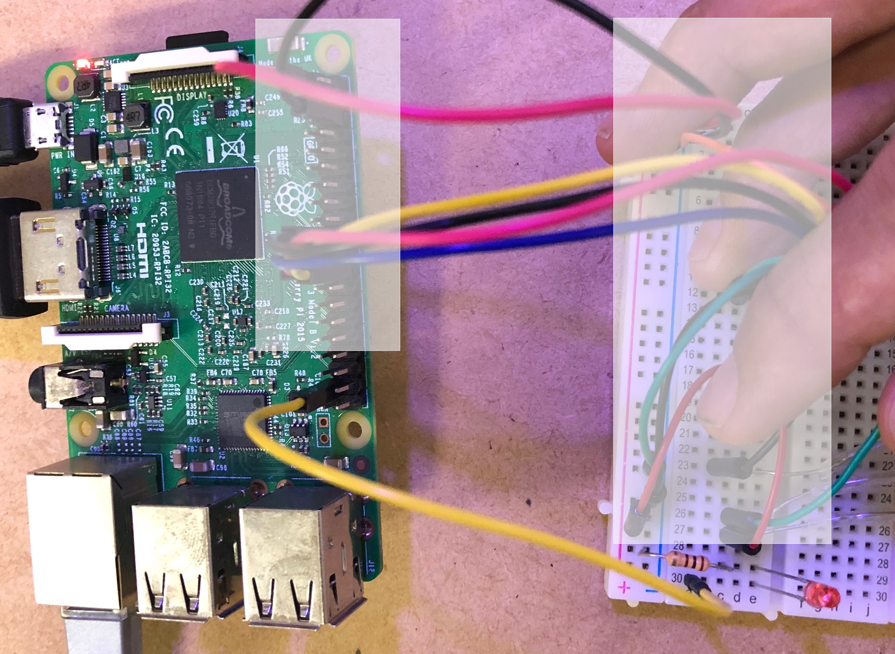
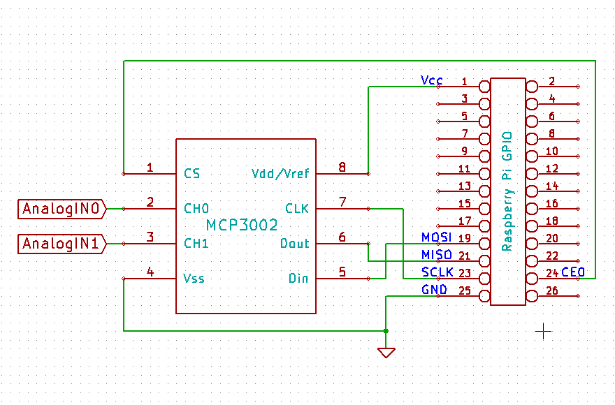
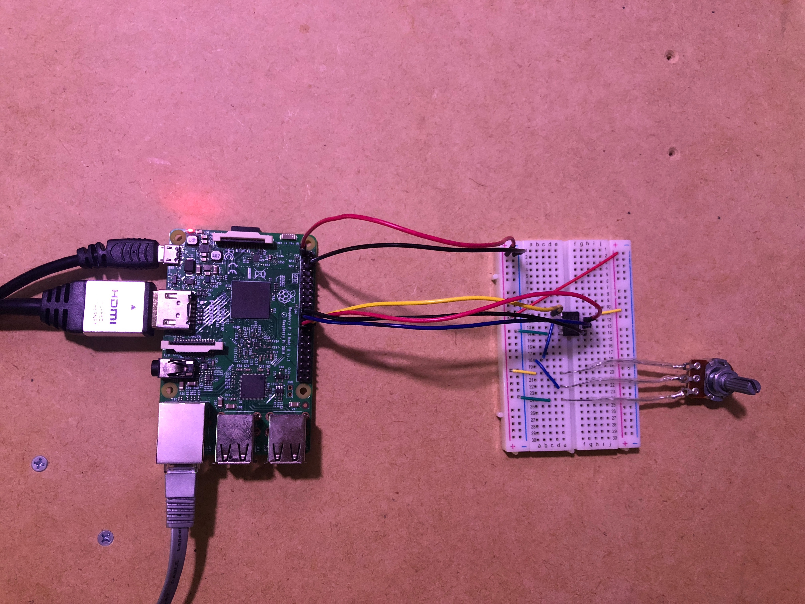
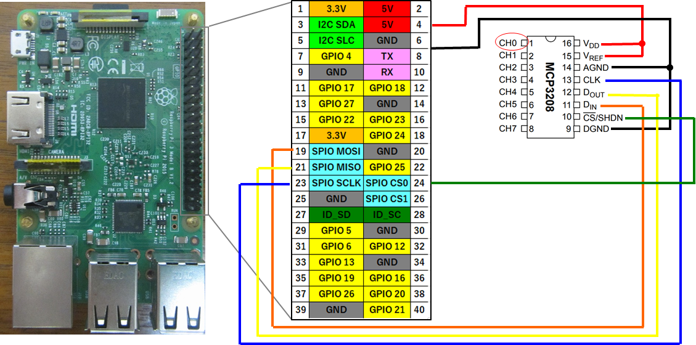
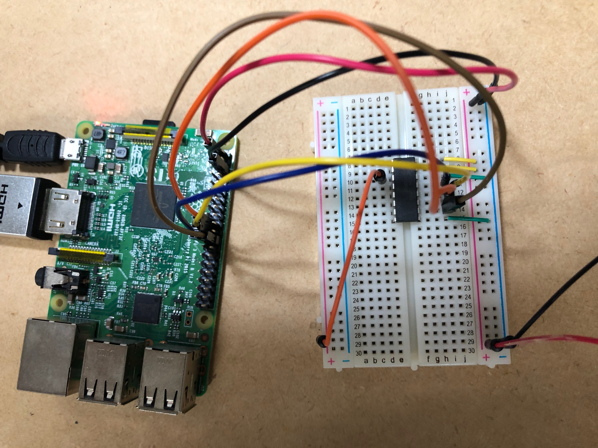
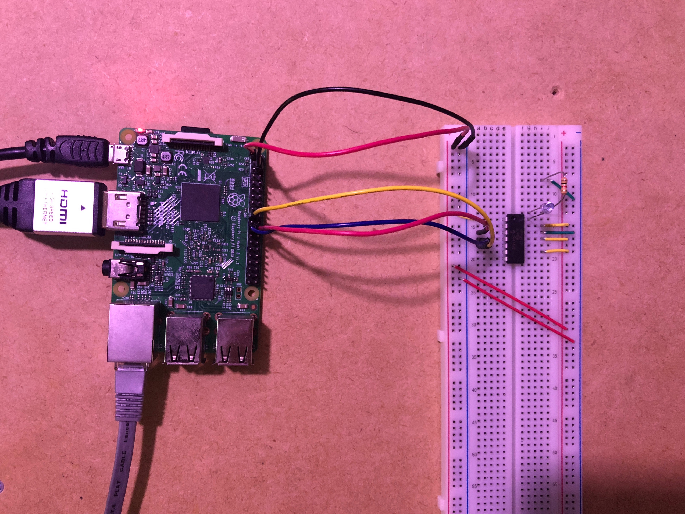
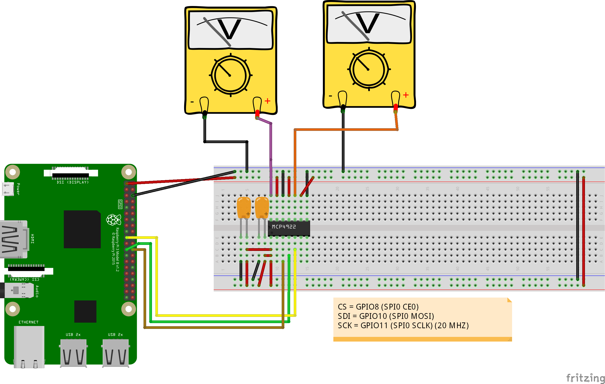
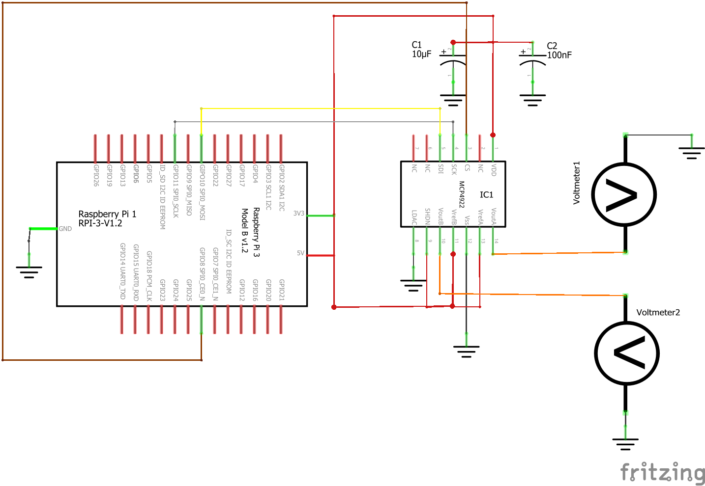
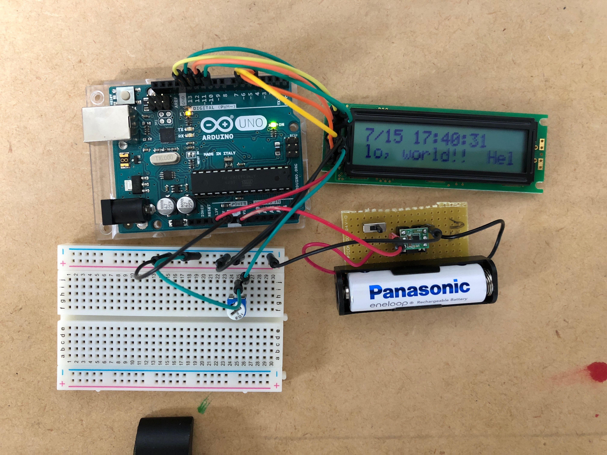
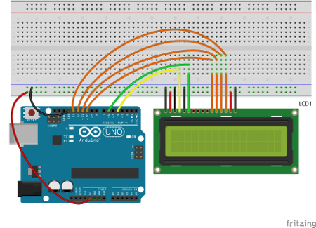

# Table of Contents

<!-- MarkdownTOC autolink="true" autoanchor="true" indent="    " -->

- [references](#references)
    - [sshトラブル](#ssh%E3%83%88%E3%83%A9%E3%83%96%E3%83%AB)
    - [ssh raspberrypi.local](#ssh-raspberrypilocal)
    - [pw](#pw)
- [raspberry piのGPIO pin](#raspberry-pi%E3%81%AEgpio-pin)
- [Macからraspbian OSをSDカードに焼く](#mac%E3%81%8B%E3%82%89raspbian-os%E3%82%92sd%E3%82%AB%E3%83%BC%E3%83%89%E3%81%AB%E7%84%BC%E3%81%8F)
- [apt-get update, upgrade](#apt-get-update-upgrade)
- [ssh](#ssh)
    - [\[例外\] "WARNING: REMOTE HOST IDENTIFICATION HAS CHANGED!"](#%E4%BE%8B%E5%A4%96-warning-remote-host-identification-has-changed)
    - [raspberrypi.localでつなぐ](#raspberrypilocal%E3%81%A7%E3%81%A4%E3%81%AA%E3%81%90)
- [windowsのcmdでsshを使えるようにする](#windows%E3%81%AEcmd%E3%81%A7ssh%E3%82%92%E4%BD%BF%E3%81%88%E3%82%8B%E3%82%88%E3%81%86%E3%81%AB%E3%81%99%E3%82%8B)
    - [openssh](#openssh)
- [パスワードの変更](#%E3%83%91%E3%82%B9%E3%83%AF%E3%83%BC%E3%83%89%E3%81%AE%E5%A4%89%E6%9B%B4)
- [パーティション](#%E3%83%91%E3%83%BC%E3%83%86%E3%82%A3%E3%82%B7%E3%83%A7%E3%83%B3)
- [emacs](#emacs)
- [PWMでのアナログ出力](#pwm%E3%81%A7%E3%81%AE%E3%82%A2%E3%83%8A%E3%83%AD%E3%82%B0%E5%87%BA%E5%8A%9B)
    - [hardware configuration](#hardware-configuration)
    - [code](#code)
- [SPI input](#spi-input)
    - [py-dev](#py-dev)
    - [spiを有効にする](#spi%E3%82%92%E6%9C%89%E5%8A%B9%E3%81%AB%E3%81%99%E3%82%8B)
        - [spiがenableになっているか確認](#spi%E3%81%8Cenable%E3%81%AB%E3%81%AA%E3%81%A3%E3%81%A6%E3%81%84%E3%82%8B%E3%81%8B%E7%A2%BA%E8%AA%8D)
        - [spi確認その2](#spi%E7%A2%BA%E8%AA%8D%E3%81%9D%E3%81%AE2)
    - [py-spidev](#py-spidev)
        - [py-spidev確認](#py-spidev%E7%A2%BA%E8%AA%8D)
    - [MCP3002](#mcp3002)
        - [hardware configuration](#hardware-configuration-1)
        - [code](#code-1)
            - [simple test](#simple-test)
    - [MCP3208](#mcp3208)
        - [hardware configuration](#hardware-configuration-2)
        - [code](#code-2)
            - [simple test](#simple-test-1)
            - [read multi data](#read-multi-data)
    - [読み取り値が0になるエラーの確認](#%E8%AA%AD%E3%81%BF%E5%8F%96%E3%82%8A%E5%80%A4%E3%81%8C0%E3%81%AB%E3%81%AA%E3%82%8B%E3%82%A8%E3%83%A9%E3%83%BC%E3%81%AE%E7%A2%BA%E8%AA%8D)
    - [references](#references-1)
        - [raspiでADコンバータでアナログセンサーを使う](#raspi%E3%81%A7ad%E3%82%B3%E3%83%B3%E3%83%90%E3%83%BC%E3%82%BF%E3%81%A7%E3%82%A2%E3%83%8A%E3%83%AD%E3%82%B0%E3%82%BB%E3%83%B3%E3%82%B5%E3%83%BC%E3%82%92%E4%BD%BF%E3%81%86)
        - [spidev関係のエラー](#spidev%E9%96%A2%E4%BF%82%E3%81%AE%E3%82%A8%E3%83%A9%E3%83%BC)
- [SPI output](#spi-output)
    - [MCP4922](#mcp4922)
        - [install Python-RPi-MCP4922](#install-python-rpi-mcp4922)
        - [hardware configuration](#hardware-configuration-3)
        - [code](#code-3)
            - [simple test](#simple-test-2)
            - [fade test](#fade-test)
    - [references](#references-2)
        - [SPI](#spi)
        - [DA, ADを同時に使う](#da-ad%E3%82%92%E5%90%8C%E6%99%82%E3%81%AB%E4%BD%BF%E3%81%86)
        - [raspberry piでのGPIO](#raspberry-pi%E3%81%A7%E3%81%AEgpio)
        - [MCP4922 with raspberry pi](#mcp4922-with-raspberry-pi)
        - [MCP4922 with arduino](#mcp4922-with-arduino)
        - [I2C](#i2c)
        - [その他](#%E3%81%9D%E3%81%AE%E4%BB%96)
- [scipy](#scipy)
    - [install](#install)
- [タッチセンサ](#%E3%82%BF%E3%83%83%E3%83%81%E3%82%BB%E3%83%B3%E3%82%B5)
    - [hardware configure](#hardware-configure)
    - [code](#code-4)
        - [simple threshold](#simple-threshold)
        - [low-pass filter](#low-pass-filter)
    - [references](#references-3)
        - [マルチタッチパネル](#%E3%83%9E%E3%83%AB%E3%83%81%E3%82%BF%E3%83%83%E3%83%81%E3%83%91%E3%83%8D%E3%83%AB)
        - [タッチセンサ](#%E3%82%BF%E3%83%83%E3%83%81%E3%82%BB%E3%83%B3%E3%82%B5-1)
- [Time](#time)
    - [setup](#setup)
    - [code](#code-5)
    - [references](#references-4)
- [LCD](#lcd)
    - [hardware configure](#hardware-configure-1)
    - [code](#code-6)
        - [simple lcd](#simple-lcd)
        - [lcd change](#lcd-change)
        - [lcd time](#lcd-time)
    - [references](#references-5)
        - [LCD 1602B SC1602BSLB](#lcd-1602b-sc1602bslb)
        - [LCD 1602A](#lcd-1602a)
- [ホールセンサー](#%E3%83%9B%E3%83%BC%E3%83%AB%E3%82%BB%E3%83%B3%E3%82%B5%E3%83%BC)
    - [A1324LUA-T](#a1324lua-t)
        - [code](#code-7)
            - [simple analog-input](#simple-analog-input)
            - [convert to gauss](#convert-to-gauss)
    - [references](#references-6)

<!-- /MarkdownTOC -->


---
<!-- ############################################################################## -->
<!-- ############################################################################## -->
<a id="references"></a>
# references
https://qiita.com/py_iK/items/9070fc58f69d8c063e44
https://qiita.com/onlyindreams/items/acc70807b69b43e176bf
https://www.fabshop.jp/%E6%97%A5%E6%9C%AC%E8%AA%9E%E8%A1%A8%E7%A4%BA-noobs-%E6%9C%80%E6%96%B0-ver-2-0-0%E3%82%92-%E3%82%A4%E3%83%B3%E3%82%B9%E3%83%88%E3%83%BC%E3%83%AB%E3%81%97%E3%81%A6%E3%81%BF%E3%81%BE%E3%81%97%E3%81%9F/
https://en.wikipedia.org/wiki/Raspbian

<!-- ############################################################################## -->
<a id="ssh%E3%83%88%E3%83%A9%E3%83%96%E3%83%AB"></a>
## sshトラブル
- [Raspberry PiにSSHで "WARNING: REMOTE HOST IDENTIFICATION HAS CHANGED!" エラー](https://qiita.com/xshell/items/1a77de4bfa80167a7923)
- [RaspberrypiでSSHができなくて試したこと](https://qiita.com/hayate242/items/0de7a98f6fea0dabf04c)

<!-- ############################################################################## -->
<a id="ssh-raspberrypilocal"></a>
## ssh raspberrypi.local
- [IPアドレスがわからないラズパイにホスト名でSSH接続する簡単な方法（mDNS）](https://iot-plus.net/make/raspi/ssh-connect-using-mdns/)

<!-- ############################################################################## -->
<a id="pw"></a>
## pw
- [Raspberry Pi 3にRaspbianをインストール(Mac OS X を使用)](https://qiita.com/onlyindreams/items/acc70807b69b43e176bf)


---
<!-- ############################################################################## -->
<!-- ############################################################################## -->
<a id="raspberry-pi%E3%81%AEgpio-pin"></a>
# raspberry piのGPIO pin

- GPIOの表(引用)


- GPIOの調べ方

```
raspi) $ gpio readall
 +-----+-----+---------+------+---+---Pi 3---+---+------+---------+-----+-----+
 | BCM | wPi |   Name  | Mode | V | Physical | V | Mode | Name    | wPi | BCM |
 +-----+-----+---------+------+---+----++----+---+------+---------+-----+-----+
 |     |     |    3.3v |      |   |  1 || 2  |   |      | 5v      |     |     |
 |   2 |   8 |   SDA.1 |   IN | 1 |  3 || 4  |   |      | 5v      |     |     |
 |   3 |   9 |   SCL.1 |   IN | 1 |  5 || 6  |   |      | 0v      |     |     |
 |   4 |   7 | GPIO. 7 |   IN | 1 |  7 || 8  | 0 | IN   | TxD     | 15  | 14  |
 |     |     |      0v |      |   |  9 || 10 | 1 | IN   | RxD     | 16  | 15  |
 |  17 |   0 | GPIO. 0 |   IN | 0 | 11 || 12 | 0 | IN   | GPIO. 1 | 1   | 18  |
 |  27 |   2 | GPIO. 2 |   IN | 0 | 13 || 14 |   |      | 0v      |     |     |
 |  22 |   3 | GPIO. 3 |   IN | 0 | 15 || 16 | 0 | IN   | GPIO. 4 | 4   | 23  |
 |     |     |    3.3v |      |   | 17 || 18 | 0 | IN   | GPIO. 5 | 5   | 24  |
 |  10 |  12 |    MOSI | ALT0 | 0 | 19 || 20 |   |      | 0v      |     |     |
 |   9 |  13 |    MISO | ALT0 | 0 | 21 || 22 | 0 | IN   | GPIO. 6 | 6   | 25  |
 |  11 |  14 |    SCLK | ALT0 | 0 | 23 || 24 | 1 | OUT  | CE0     | 10  | 8   |
 |     |     |      0v |      |   | 25 || 26 | 1 | OUT  | CE1     | 11  | 7   |
 |   0 |  30 |   SDA.0 |   IN | 1 | 27 || 28 | 1 | IN   | SCL.0   | 31  | 1   |
 |   5 |  21 | GPIO.21 |   IN | 1 | 29 || 30 |   |      | 0v      |     |     |
 |   6 |  22 | GPIO.22 |   IN | 1 | 31 || 32 | 0 | IN   | GPIO.26 | 26  | 12  |
 |  13 |  23 | GPIO.23 |   IN | 0 | 33 || 34 |   |      | 0v      |     |     |
 |  19 |  24 | GPIO.24 |   IN | 0 | 35 || 36 | 0 | IN   | GPIO.27 | 27  | 16  |
 |  26 |  25 | GPIO.25 |   IN | 0 | 37 || 38 | 0 | IN   | GPIO.28 | 28  | 20  |
 |     |     |      0v |      |   | 39 || 40 | 0 | IN   | GPIO.29 | 29  | 21  |
 +-----+-----+---------+------+---+----++----+---+------+---------+-----+-----+
 | BCM | wPi |   Name  | Mode | V | Physical | V | Mode | Name    | wPi | BCM |
 +-----+-----+---------+------+---+---Pi 3---+---+------+---------+-----+-----+
```

ref: [Raspberry Piでコマンドをゆっくりマスタしよう　(12) gpio](https://www.denshi.club/make/2016/02/raspberry-pi2-3.html)

---
<!-- ############################################################################## -->
<!-- ############################################################################## -->
<a id="mac%E3%81%8B%E3%82%89raspbian-os%E3%82%92sd%E3%82%AB%E3%83%BC%E3%83%89%E3%81%AB%E7%84%BC%E3%81%8F"></a>
# Macからraspbian OSをSDカードに焼く
この方: 

- [RASPBIAN](https://www.raspberrypi.org/downloads/raspbian/)
- [MacでRaspberryPi入門](https://qiita.com/py_iK/items/9070fc58f69d8c063e44)
- [Raspberry Pi 3にRaspbianをインストール(Mac OS X を使用)](https://qiita.com/onlyindreams/items/acc70807b69b43e176bf)
- [Raspberry Pi の基本](https://qiita.com/Brutus/items/1683b5b3eac929047d12)
- [日本語表示 NOOBS 最新 ver.2.0.0を インストールしてみました](https://www.fabshop.jp/%E6%97%A5%E6%9C%AC%E8%AA%9E%E8%A1%A8%E7%A4%BA-noobs-%E6%9C%80%E6%96%B0-ver-2-0-0%E3%82%92-%E3%82%A4%E3%83%B3%E3%82%B9%E3%83%88%E3%83%BC%E3%83%AB%E3%81%97%E3%81%A6%E3%81%BF%E3%81%BE%E3%81%97%E3%81%9F/)
を参考にsetupしていく. 
- [2017年ラズベリーパイ各種OS・ディストリビューションまとめ1(汎用編)](https://itdecoboconikki.com/2017/03/17/2017-raspberry-pi-os-curate-1/)
- [Raspberry Pi 3 にROSをインストール](http://ishi.main.jp/ros/ros_rpi3.html)
- [Raspbian](https://en.wikipedia.org/wiki/Raspbian)
- [第51回「新しいOS、Raspbian Jessie with PIXEL」](https://deviceplus.jp/hobby/raspberrypi_entry_051/)

NOOBSはraspberrypiのOSのインストーラーらしい.   
実際, raspbianをインストールするなら, raspbianをDLしてやっていくほうがいいらしい. 

- RASPBIAN STRETCH WITH DESKTOPをDL [raspbian](https://www.raspberrypi.org/downloads/raspbian/)
> RASPBIAN STRETCH WITH DESKTOP  
Image with desktop based on Debian Stretch  
Version:June 2018  
Release date:2018-06-27  
Kernel version:4.14  
Release notes:Link  
- zipをunarchiverでunzipしてimgにする

- micro SDカードをフォーマット
- micro SDカードを確認

```
mac) $ diskutil list
.
.
.
/dev/disk4 (external, physical):
   #:                       TYPE NAME                    SIZE       IDENTIFIER
   0:      GUID_partition_scheme                        *7.8 GB     disk4
   1:                        EFI EFI                     209.7 MB   disk4s1
   2:       Microsoft Basic Data RASPBERRYPI             7.6 GB     disk4s2
```

- micro SDカードをunmount

```
mac) $ diskutil unMountDisk /dev/disk4
```

- micro SDカードにraaspbian imgを書き込む

```
mac) $ sudo dd if=2018-06-27-raspbian-stretch.img of=/dev/rdisk4 bs=1m
```

> `ctrl + t`で進捗がわかる

---
<!-- ############################################################################## -->
<!-- ############################################################################## -->
<a id="apt-get-update-upgrade"></a>
# apt-get update, upgrade

```
raspi) $ sudo apt-get update
raspi) $ sudo apt-get upgrade
```


---
<!-- ############################################################################## -->
<!-- ############################################################################## -->
<a id="ssh"></a>
# ssh

```
raspi) $ sudo raspi-config
raspi) [選択] 5 Interfacing Options
raspi) [選択] P2 SSH
raspi) [選択] Enable
raspi) $ reboot
```


他のPCからmacからsshする場合は, 同一ネットワーク内で

```
mac) $ arp -a
:
:
raspberrypi (192.168.1.234) at a1:a2:a3:a4:a5:a6 on en0 ifscope [ethernet]
:
:
```
のようにして調べられる. 
(raspiのIPが`192.168.1.234`だと仮定)

あとはこのIPで
```
mac) $ ssh pi@192.168.1.234
```
とすればつなげられる. 

<!-- ############################################################################## -->
<a id="%E4%BE%8B%E5%A4%96-warning-remote-host-identification-has-changed"></a>
## [例外] "WARNING: REMOTE HOST IDENTIFICATION HAS CHANGED!"
以前に同じIPの違うraspi(PC?)につないだことがあると警告: 
"WARNING: REMOTE HOST IDENTIFICATION HAS CHANGED!"
が出てsshできないことがある. 

```
mac) $ ssh-keygen -R 192.168.1.234

質問にはyes
Are you sure you want to continue connecting (yes/no)? yes
```

で鍵作成(リセット)すればアクセス可能になる. 

- [Raspberry PiにSSHで "WARNING: REMOTE HOST IDENTIFICATION HAS CHANGED!" エラー](https://qiita.com/xshell/items/1a77de4bfa80167a7923)
- [RaspberrypiでSSHができなくて試したこと](https://qiita.com/hayate242/items/0de7a98f6fea0dabf04c)


<!-- ############################################################################## -->
<a id="raspberrypilocal%E3%81%A7%E3%81%A4%E3%81%AA%E3%81%90"></a>
## raspberrypi.localでつなぐ
デフォルトの設定のままなら

```
mac) $ ssh raspberrypi.local
```
でもつなげられる. 

> "WARNING: REMOTE HOST IDENTIFICATION HAS CHANGED!"が出た場合は, 前項同様に  
> `mac) $ ssh-keygen -R raspberrypi.local`  
> でリセットすればOK

これは, 

```
mac) $ ssh {ユーザー名}@{ホスト名}.local 
```
という意味. 

raspi-configなどでhostnameをいじっている場合は, raspi上で

```
raspi) $ raspi-config
raspberrypi
```
とすればわかる. 

- [IPアドレスがわからないラズパイにホスト名でSSH接続する簡単な方法（mDNS）](https://iot-plus.net/make/raspi/ssh-connect-using-mdns/)


<a id="windows%E3%81%AEcmd%E3%81%A7ssh%E3%82%92%E4%BD%BF%E3%81%88%E3%82%8B%E3%82%88%E3%81%86%E3%81%AB%E3%81%99%E3%82%8B"></a>
# windowsのcmdでsshを使えるようにする

<a id="openssh"></a>
## openssh

---
<!-- ############################################################################## -->
<!-- ############################################################################## -->
<a id="%E3%83%91%E3%82%B9%E3%83%AF%E3%83%BC%E3%83%89%E3%81%AE%E5%A4%89%E6%9B%B4"></a>
# パスワードの変更
セキュリティのためにはパスワードは変更した方が良い. 遊ぶだけならそのままでも良いかも. 

```
raspi) $ sudo passwd pi
Enter new UNIX password: 
Retype new UNIX password: 
passwd: password updated successfully
```


- [Raspberry Pi 3にRaspbianをインストール(Mac OS X を使用)](https://qiita.com/onlyindreams/items/acc70807b69b43e176bf)


---
<!-- ############################################################################## -->
<!-- ############################################################################## -->
<a id="%E3%83%91%E3%83%BC%E3%83%86%E3%82%A3%E3%82%B7%E3%83%A7%E3%83%B3"></a>
# パーティション
場合によってはSDカード容量をフルに使用していないことがあるらしい

fdiskを使用開始

```
raspi) $ sudo fdisk /dev/mmcblk0 
```


容量を確認

```
Command (m for help): p
Disk /dev/mmcblk0: 7.3 GiB, 7780433920 bytes, 15196160 sectors
Units: sectors of 1 * 512 = 512 bytes
Sector size (logical/physical): 512 bytes / 512 bytes
I/O size (minimum/optimal): 512 bytes / 512 bytes
Disklabel type: dos
Disk identifier: 0x578f5921

Device         Boot Start      End  Sectors  Size Id Type
/dev/mmcblk0p1       8192    96663    88472 43.2M  c W95 FAT32 (LBA)
/dev/mmcblk0p2      98304 15196159 15097856  7.2G 83 Linux
```
今回は8GBのmicro SDだったのでこれで良さそう. 


fdiskでhelpをみる

```
Command (m for help): m

Help:

  DOS (MBR)
   a   toggle a bootable flag
   b   edit nested BSD disklabel
   c   toggle the dos compatibility flag

  Generic
   d   delete a partition
   F   list free unpartitioned space
   l   list known partition types
   n   add a new partition
   p   print the partition table
   t   change a partition type
   v   verify the partition table
   i   print information about a partition

  Misc
   m   print this menu
   u   change display/entry units
   x   extra functionality (experts only)

  Script
   I   load disk layout from sfdisk script file
   O   dump disk layout to sfdisk script file

  Save & Exit
   w   write table to disk and exit
   q   quit without saving changes

  Create a new label
   g   create a new empty GPT partition table
   G   create a new empty SGI (IRIX) partition table
   o   create a new empty DOS partition table
   s   create a new empty Sun partition table
```


fdiskを変更保存しないで使用終了

```
Command (m for help): q
```

- [Raspberry Pi 3にRaspbianをインストール(Mac OS X を使用)](https://qiita.com/onlyindreams/items/acc70807b69b43e176bf)


---
<!-- ############################################################################## -->
<!-- ############################################################################## -->
<a id="emacs"></a>
# emacs

- [DOCUMENTATION > LINUX > USAGE > TEXT-EDITORS](https://www.raspberrypi.org/documentation/linux/usage/text-editors.md)
を参考に

```
sudo apt-get install emacs
```
でinstallできる. 

過去記事で

- [Raspberry PiでEmacs 24.5とCaskを使う](https://qiita.com/masato/items/d6b35db6d63222d67812)
- [Raspberry piに最新のEmacsをインストールする](http://akaneko85r.hatenablog.com/entry/2015/05/15/234735)

というものがあったので, 場合によっては注意が必要なのかもしれない(試していない). 


---
<!-- ############################################################################## -->
<!-- ############################################################################## -->
<a id="pwm%E3%81%A7%E3%81%AE%E3%82%A2%E3%83%8A%E3%83%AD%E3%82%B0%E5%87%BA%E5%8A%9B"></a>
# PWMでのアナログ出力

PWMでのアナログ出力 (PWM: Pulse Width Modulation)について.   
様々なGPIOの方法がまとめられていて有り難い:

- [任意の言語で Raspberry Pi デジタル入出力、アナログ出力 (PWM)](https://www.qoosky.io/techs/ae21424afa)

を参考にpythonでアナログ出力する例を書く. 

<a id="hardware-configuration"></a>
## hardware configuration


<a id="code"></a>
## code

pwm-out_test.py

```
#!/usr/bin/env python
# -*- coding: utf-8 -*-
import RPi.GPIO as GPIO
import time

# 初期設定
GPIO.setmode(GPIO.BCM)

# GPIO 26 を出力に設定
pinOut = 26
GPIO.setup(pinOut, GPIO.OUT)

# PWM 設定
freq = 50 # Hz (PWM のパルスを一秒間に 50 個生成)
duty = 0.0 # デューティー比 0.0 で出力開始 (パルス内に占める HIGH 状態の時間が 0.0 %)
pwm = GPIO.PWM(pinOut, freq)
pwm.start(duty)

try:
    # デューティー比 (duty cycle) を 0..100 の範囲で変化 (Ctrl-C 待ち)
    while True:
        duty = (duty + 1) % 101
        print "%s GPIO 26 duty cycle %d%%" % (time.strftime("%Y/%m/%d %H:%M:%S"), duty)
        pwm.ChangeDutyCycle(duty)
        time.sleep(0.1)
except:
    print "interrupted"
finally:
    # 後片付け
    pwm.stop()
    GPIO.cleanup()
```

---
<!-- ############################################################################## -->
<!-- ############################################################################## -->
<a id="spi-input"></a>
# SPI input

<!-- ############################################################################## -->
<a id="py-dev"></a>
## py-dev

```
raspi) $ sudo apt-get install python-dev
パッケージリストを読み込んでいます... 完了
依存関係ツリーを作成しています                
状態情報を読み取っています... 完了
python-dev はすでに最新バージョン (2.7.13-2) です。
python-dev は手動でインストールしたと設定されました。
アップグレード: 0 個、新規インストール: 0 個、削除: 0 個、保留: 0 個。
```

<!-- ############################################################################## -->
<a id="spi%E3%82%92%E6%9C%89%E5%8A%B9%E3%81%AB%E3%81%99%E3%82%8B"></a>
## spiを有効にする

```
raspi) $ sudo vi /boot/config.txt
```
でconfig.txtを開いて, `dtparam=spi=on`をコメントアウトする. 

```
:
:
# Uncomment some or all of these to enable the optional hardware interfaces
#dtparam=i2c_arm=on
#dtparam=i2s=on
dtparam=spi=on
:
:
```

反映させるためにreboot

```
raspi) $ sudo reboot
```


<!-- ############################################################################## -->
<a id="spi%E3%81%8Cenable%E3%81%AB%E3%81%AA%E3%81%A3%E3%81%A6%E3%81%84%E3%82%8B%E3%81%8B%E7%A2%BA%E8%AA%8D"></a>
### spiがenableになっているか確認

```
raspi) $ lsmod
Module                  Size  Used by
fuse                  106496  3
rfcomm                 49152  6
cmac                   16384  1
uhid                   20480  1
bnep                   20480  2
hci_uart               36864  1
btbcm                  16384  1 hci_uart
serdev                 20480  1 hci_uart
bluetooth             368640  29 hci_uart,bnep,btbcm,rfcomm
ecdh_generic           28672  1 bluetooth
cfg80211              573440  0
rfkill                 28672  4 bluetooth,cfg80211
spidev                 16384  0
snd_bcm2835            32768  1
snd_pcm                98304  1 snd_bcm2835
snd_timer              32768  1 snd_pcm
spi_bcm2835            16384  0
snd                    69632  5 snd_timer,snd_bcm2835,snd_pcm
uio_pdrv_genirq        16384  0
uio                    20480  1 uio_pdrv_genirq
fixed                  16384  0
i2c_dev                16384  0
ip_tables              24576  0
x_tables               32768  1 ip_tables
ipv6                  434176  24
```

```
spi_bcm2835            16384  0
```
となり有効になっているのでOK. `spi_bcm{番号}`の番号は違っていても良いらしい. 

<!-- ############################################################################## -->
<a id="spi%E7%A2%BA%E8%AA%8D%E3%81%9D%E3%81%AE2"></a>
### spi確認その2

```
raspi) $ ls /dev/spi*
/dev/spidev0.0  /dev/spidev0.1
```
ここで, 上記の2つが出てくればOK.   
ただし, `/dev/spidev0.1`のみだったり, 1つもdirectryが出てこないと何かしらでコケている可能性がある.   
この方: 

- [ラズパイでSPIが使えない(未解決)](https://qiita.com/clses/items/ecc23d0a1d7a762958ae)

の症状に近い現象が発生し, うまくいかなかったことがある. 未解決のまま. 
その際は, [cocopar 3.2インチ ディスプレイ　タッチパネル](http://amzn.asia/i22FvbV)のようなものを過去に使用したことがあった気がするので, それが影響しているのかもしれない. 

その他のエラー参考: 
- [raspberry piで/dev/spidev0.0が無いと言われた時の対処方法](http://asukiaaa.blogspot.com/2015/03/raspberry-pidevspidev00.html)
- [spi.open(0,0) IOError: Errno 2 No such file or directory](https://www.raspberrypi.org/forums/viewtopic.php?t=154317)

<!-- ############################################################################## -->
<a id="py-spidev"></a>
## py-spidev
spi deviceを操作するpython module.   
[https://github.com/doceme/py-spidev](https://github.com/doceme/py-spidev) からソースコードを取得してインストールする. 

好きなdirectryで下記を実行

```
raspi) $ git clone git://github.com/doceme/py-spidev
raspi) $ cd py-spidev
raspi) $ sudo python setup.py install
```


<!-- ############################################################################## -->
<a id="py-spidev%E7%A2%BA%E8%AA%8D"></a>
### py-spidev確認
pythonを起動し, py-spidevが使えるか自体をテスト. 

pythonを起動

```
raspi) $ python
```

py-spidevをimportしてopenしてテストしてみる

```
>>> import spidev
>>> spi = spidev.SpiDev()
>>> spi.open(0,0)
```
のように, 何も出なければOK. 

```
>>> exit()
```
で出る. 

もし, これで
```
Traceback (most recent call last):
  File "pyhome/light.py", line 9, in <module>
    spi.open(0,0)
IOError: [Errno 2] No such file or directory
```
などとでたら, 

- [ラズパイでSPIが使えない(未解決)](https://qiita.com/clses/items/ecc23d0a1d7a762958ae)
- [raspberry piで/dev/spidev0.0が無いと言われた時の対処方法](http://asukiaaa.blogspot.com/2015/03/raspberry-pidevspidev00.html)
- [spi.open(0,0) IOError: Errno 2 No such file or directory](https://www.raspberrypi.org/forums/viewtopic.php?t=154317)

と似た症状と思われる. 


<!-- ############################################################################## -->
<a id="mcp3002"></a>
## MCP3002

実際にAD変換を利用してreadテストをしてみる. 

- [Raspberry PiにA/DコンバータMCP3002をつなぐ](https://qiita.com/f_nishio/items/4b9723c4e622a51aaeb5)
- [Raspberry Piで正統派のアナログ入力](http://www.hoihoido.com/blog/wp/?p=765)

を参考に[MCP3002](http://akizukidenshi.com/catalog/g/gI-02584/)を使用してテストしてみた. 

- [１０ｂｉｔ　２ｃｈ　ＡＤコンバータ　ＭＣＰ３００２－Ｉ／Ｐ](http://akizukidenshi.com/catalog/g/gI-02584/)

<!-- ############################################################################## -->
<a id="hardware-configuration-1"></a>
### hardware configuration

[Raspberry Piで正統派のアナログ入力](http://www.hoihoido.com/blog/wp/?p=765)より引用



<!-- ############################################################################## -->
<a id="code-1"></a>
### code

<!-- ############################################################################## -->
<a id="simple-test"></a>
#### simple test

input-spidev_test.py

[](https://www.youtube.com/watch?v=IAsF3Zv5p9Y)

```
#!/usr/bin/env python
# Read the analog sensor value via MCP3002.

import spidev
import time

CE=0
# open SPI device 0.0
spi = spidev.SpiDev()
spi.open(0,CE)
spi.max_speed_hz = 5000

try:
    while True:
        resp = spi.xfer2([0x68, 0x00])
        value = (resp[0] * 256 + resp[1]) & 0x3ff
        print value
        time.sleep(1)
except KeyboardInterrupt:
    spi.close()
```

ここで, 

```
spi.max_speed_hz = 5000
```
というのがポイント.   
Raspbian OS Jessieの場合はこの行がなくても動くらしいのですが,   
Raspbian OS Stretchの場合はこの行がないと`0`としか読んでくれません. 

これは, この方の記事: 

- [Raspberry pi (Raspbian OS Stretch Lite 2017-11-29) でSPIが動かない](https://qiita.com/kikuzo/items/0ced0d55a2cb66e55199#_reference-0c0655114e87d372dd5f)

の下の, S2KTS1さんのコメントを参考にしました. 


<!-- ############################################################################## -->
<a id="mcp3208"></a>
## MCP3208


- [Raspberry Pi講座 ADコンバータ（mcp3208）](https://sites.google.com/site/memorandumjavaandalgorithm/raspberry-pi-jiang-zuo12-adkonbata-mcp3208)
- [raspberry pi2 + MCP3208](https://plaza.rakuten.co.jp/wolfy2000/diary/201512120000/)

を参考に[MCP3208](http://akizukidenshi.com/catalog/g/gI-00238/)をテストした.   
MCP3002よりもchが多く, 解像度も高い. 

- [１２ｂｉｔ　８ｃｈ　ＡＤコンバータ　ＭＣＰ３２０８－ＣＩ／Ｐ](http://akizukidenshi.com/catalog/g/gI-00238/)

<!-- ############################################################################## -->
<a id="hardware-configuration-2"></a>
### hardware configuration

[Raspberry Pi講座 ADコンバータ（mcp3208）](https://sites.google.com/site/memorandumjavaandalgorithm/raspberry-pi-jiang-zuo12-adkonbata-mcp3208)より引用

ただし, 電源は上記の図の通りの5Vではなく, 3.3Vに接続して使用しました. 



<!-- ############################################################################## -->
<a id="code-2"></a>
### code

<!-- ############################################################################## -->
<a id="simple-test-1"></a>
#### simple test

mcp3208_v2.py

```
#!/usr/bin/env python
# -*- coding: utf-8 -*-

import time
import spidev

#MCP3208から値を取得するクラス
class MCP3208_Class:

    """コンストラクタ"""
    def __init__(self, ref_volts):
        self.ref_volts = ref_volts
        self.spi = spidev.SpiDev()
        self.spi.open(0,0)
        self.spi.max_speed_hz = 5000

    """電圧取得"""
    def GetVoltage(self,ch):
        adc = self.spi.xfer2([6+((ch&4)>>2),(ch&3)<<6,0])
        raw2 = ((adc[1]&15) << 8) + adc[2]
        volts = (raw2 * self.ref_volts ) / float(1023)
        volts = round(volts,8)
        return volts

    def GetRawValue(self,ch):
        adc = self.spi.xfer2([6+((ch&4)>>2),(ch&3)<<6,0])
        raw2 = ((adc[1]&15) << 8) + adc[2]
        return raw2

    """終了処理"""
    def Cleanup(self):
        self.spi.close()

"""メイン関数"""
if __name__ == '__main__':
    ADC = MCP3208_Class(ref_volts=3.3)
    try:
        while True:
            value = ADC.GetRawValue(ch=0)
            print("value: {:8.2f}".format(value))
            time.sleep(0.1)

    except KeyboardInterrupt  :         #Ctl+Cが押されたらループを終了
        print("\nCtl+C")
    except Exception as e:
        print(str(e))
    finally:
        ADC.Cleanup()
        print("\nexit program")
```

<a id="read-multi-data"></a>
#### read multi data

mcp3208_multi_v2.py

```
#!/usr/bin/env python
# -*- coding: utf-8 -*-

import time
import spidev

#MCP3208から値を取得するクラス
class MCP3208_Class:

    """コンストラクタ"""
    def __init__(self, ref_volts):
        self.ref_volts = ref_volts
        self.spi = spidev.SpiDev()
        self.spi.open(0,0)
        self.spi.max_speed_hz = 5000

    """電圧取得"""
    def GetVoltage(self,ch):
        adc = self.spi.xfer2([6+((ch&4)>>2),(ch&3)<<6,0])
        raw2 = ((adc[1]&15) << 8) + adc[2]
        volts = (raw2 * self.ref_volts ) / float(1023)
        volts = round(volts,8)
        return volts

    def GetRawValue(self,ch):
        adc = self.spi.xfer2([6+((ch&4)>>2),(ch&3)<<6,0])
        raw2 = ((adc[1]&15) << 8) + adc[2]
        return raw2

    """終了処理"""
    def Cleanup(self):
        self.spi.close()

"""メイン関数"""
if __name__ == '__main__':
    ADC = MCP3208_Class(ref_volts=3.3)
    valuesSize = 3
    values = list(range(valuesSize))

    try:
        while True:
            for i in range(valuesSize):
                values[i] = ADC.GetRawValue(ch=i)
                #print(values[i])
                #print("value: {:8.2f}".format(value))
            print(*values, sep=' ')
            #print('\n')
            #print '\n'.join(str(p) for p in values) 
            time.sleep(0.1)

    except KeyboardInterrupt  :         #Ctl+Cが押されたらループを終了
        print("\nCtl+C")
    except Exception as e:
        print(str(e))
    finally:
        ADC.Cleanup()
        print("\nexit program")
```

<!-- ############################################################################## -->
<a id="%E8%AA%AD%E3%81%BF%E5%8F%96%E3%82%8A%E5%80%A4%E3%81%8C0%E3%81%AB%E3%81%AA%E3%82%8B%E3%82%A8%E3%83%A9%E3%83%BC%E3%81%AE%E7%A2%BA%E8%AA%8D"></a>
## 読み取り値が0になるエラーの確認

gpioの設定が大事らしい. 

```
raspi) $ gpio readall
```
した際に, 

- `MOSI`, `MISO`, `SCLK`の`Mode`が`ALT0`以外になっている(`IN`等)
- `CE0`の`Mode`が`OUT`以外になっている(`IN`等)

と, 読み取り値が`0`になってしまった. 

```
raspi) $ gpio -g mode 8 out
raspi) $ gpio -g mode 9 alt0
raspi) $ gpio -g mode 10 alt0
raspi) $ gpio -g mode 11 alt0
```
をして, 正しく設定すれば動く様になった. 

動く設定は下記の通り: 

```
raspi) $ gpio readall
 +-----+-----+---------+------+---+---Pi 3---+---+------+---------+-----+-----+
 | BCM | wPi |   Name  | Mode | V | Physical | V | Mode | Name    | wPi | BCM |
 +-----+-----+---------+------+---+----++----+---+------+---------+-----+-----+
 |     |     |    3.3v |      |   |  1 || 2  |   |      | 5v      |     |     |
 |   2 |   8 |   SDA.1 |   IN | 1 |  3 || 4  |   |      | 5v      |     |     |
 |   3 |   9 |   SCL.1 |   IN | 1 |  5 || 6  |   |      | 0v      |     |     |
 |   4 |   7 | GPIO. 7 |   IN | 1 |  7 || 8  | 0 | IN   | TxD     | 15  | 14  |
 |     |     |      0v |      |   |  9 || 10 | 1 | IN   | RxD     | 16  | 15  |
 |  17 |   0 | GPIO. 0 |   IN | 0 | 11 || 12 | 0 | IN   | GPIO. 1 | 1   | 18  |
 |  27 |   2 | GPIO. 2 |   IN | 0 | 13 || 14 |   |      | 0v      |     |     |
 |  22 |   3 | GPIO. 3 |   IN | 0 | 15 || 16 | 0 | IN   | GPIO. 4 | 4   | 23  |
 |     |     |    3.3v |      |   | 17 || 18 | 0 | IN   | GPIO. 5 | 5   | 24  |
 |  10 |  12 |    MOSI | ALT0 | 0 | 19 || 20 |   |      | 0v      |     |     |
 |   9 |  13 |    MISO | ALT0 | 0 | 21 || 22 | 0 | IN   | GPIO. 6 | 6   | 25  |
 |  11 |  14 |    SCLK | ALT0 | 0 | 23 || 24 | 1 | OUT  | CE0     | 10  | 8   |
 |     |     |      0v |      |   | 25 || 26 | 1 | OUT  | CE1     | 11  | 7   |
 |   0 |  30 |   SDA.0 |   IN | 1 | 27 || 28 | 1 | IN   | SCL.0   | 31  | 1   |
 |   5 |  21 | GPIO.21 |   IN | 1 | 29 || 30 |   |      | 0v      |     |     |
 |   6 |  22 | GPIO.22 |   IN | 1 | 31 || 32 | 0 | IN   | GPIO.26 | 26  | 12  |
 |  13 |  23 | GPIO.23 |   IN | 0 | 33 || 34 |   |      | 0v      |     |     |
 |  19 |  24 | GPIO.24 |   IN | 0 | 35 || 36 | 0 | IN   | GPIO.27 | 27  | 16  |
 |  26 |  25 | GPIO.25 |   IN | 0 | 37 || 38 | 0 | IN   | GPIO.28 | 28  | 20  |
 |     |     |      0v |      |   | 39 || 40 | 0 | IN   | GPIO.29 | 29  | 21  |
 +-----+-----+---------+------+---+----++----+---+------+---------+-----+-----+
 | BCM | wPi |   Name  | Mode | V | Physical | V | Mode | Name    | wPi | BCM |
 +-----+-----+---------+------+---+---Pi 3---+---+------+---------+-----+-----+
```


<!-- ############################################################################## -->
<a id="references-1"></a>
## references

<!-- ############################################################################## -->
<a id="raspi%E3%81%A7ad%E3%82%B3%E3%83%B3%E3%83%90%E3%83%BC%E3%82%BF%E3%81%A7%E3%82%A2%E3%83%8A%E3%83%AD%E3%82%B0%E3%82%BB%E3%83%B3%E3%82%B5%E3%83%BC%E3%82%92%E4%BD%BF%E3%81%86"></a>
### raspiでADコンバータでアナログセンサーを使う

- [Raspberry PiにA/DコンバータMCP3002をつなぐ](https://qiita.com/f_nishio/items/4b9723c4e622a51aaeb5)
- [SpiDev Documentation](http://tightdev.net/SpiDev_Doc.pdf)
- [１０ｂｉｔ　２ｃｈ　ＡＤコンバータ　ＭＣＰ３００２－Ｉ／Ｐ](http://akizukidenshi.com/catalog/g/gI-02584/)
- [Raspberry Piで正統派のアナログ入力](http://www.hoihoido.com/blog/wp/?p=765)
- [Raspberry Pi講座 ADコンバータ（mcp3208）](https://sites.google.com/site/memorandumjavaandalgorithm/raspberry-pi-jiang-zuo12-adkonbata-mcp3208)
- [はじめてのAD変換（RaspberryPi3で試すアナログ・デジタル変換）](https://qiita.com/shiraco/items/8c2587ae5a647b4f9803)
- [Raspberry PiでA/DコンバーターMCP3002を使ってAD変換をしました](http://tekitoh-memdhoi.info/views/745)

<!-- ############################################################################## -->
<a id="spidev%E9%96%A2%E4%BF%82%E3%81%AE%E3%82%A8%E3%83%A9%E3%83%BC"></a>
### spidev関係のエラー

- [ラズパイでSPIが使えない(未解決)](https://qiita.com/clses/items/ecc23d0a1d7a762958ae)
- [raspberry piで/dev/spidev0.0が無いと言われた時の対処方法](http://asukiaaa.blogspot.com/2015/03/raspberry-pidevspidev00.html)
- [spi.open(0,0) IOError: Errno 2 No such file or directory](https://www.raspberrypi.org/forums/viewtopic.php?t=154317)
- [Raspberry pi (Raspbian OS Stretch Lite 2017-11-29) でSPIが動かない](https://qiita.com/kikuzo/items/0ced0d55a2cb66e55199#_reference-0c0655114e87d372dd5f)
- [spidev in Raspbian help](https://www.raspberrypi.org/forums/viewtopic.php?f=44&t=21875)


---
<!-- ############################################################################## -->
<!-- ############################################################################## -->
<a id="spi-output"></a>
# SPI output

```
SCLK(Serial CLocK) = SCK
MISO(Master In Slave Out) = DO(Data Out) = SDO(Serial Data Out)
MOSI(Master Out Slave In)  = DI(Data In) = SDI(Serial Data In)
SS(Slave Select) = CS(Chip Select) = /CS
```

<!-- ############################################################################## -->
<a id="mcp4922"></a>
## MCP4922

<!-- ############################################################################## -->
<a id="install-python-rpi-mcp4922"></a>
### install Python-RPi-MCP4922
- [Python-RPi-MCP4922](https://github.com/mrwunderbar666/Python-RPi-MCP4922)

を使用して動いた. spidevだったり, 自作のcodeでできるように調べたがまだうまくいっていない.   
arduinoではうまくいくのだがなぜだろう...
```
git clone https://github.com/mrwunderbar666/Python-RPi-MCP4922.git
cd Python-RPi-MCP4922
sudo python setup.py install
```

<!-- ############################################################################## -->
<a id="hardware-configuration-3"></a>
### hardware configuration



[Python Library for driving MCP4922 DAC on Raspberry Pi](https://github.com/mrwunderbar666/Python-RPi-MCP4922)より引用

[Python Library for driving MCP4922 DAC on Raspberry Pi](https://github.com/mrwunderbar666/Python-RPi-MCP4922)より引用

<!-- ############################################################################## -->
<a id="code-3"></a>
### code

<!-- ############################################################################## -->
<a id="simple-test-2"></a>
#### simple test

```
import RPi.GPIO as GPIO
GPIO.setmode(GPIO.BCM)
from MCP4922 import MCP4922
dac = MCP4922(spibus=0, spidevice=0, cs=8)
#dac = MCP4922(spibus=0, spidevice=1, cs=9)
dac.setVoltage(0, 3500)
```

<!-- ############################################################################## -->
<a id="fade-test"></a>
#### fade test
[](https://www.youtube.com/watch?v=5ybh4jTfIk4)

```
#!/usr/bin/python
# Python Library for MCP4922 DAC
# 2 Channels, 12 Bit

import time
import sys
import RPi.GPIO as GPIO
import numpy as np

from MCP4922 import MCP4922

GPIO.setmode(GPIO.BCM)   # use the Broadcom pin numbering
GPIO.setwarnings(False)  # disable warnings

if __name__ == '__main__':
    dac = MCP4922()
    divNum = 5000;

    try:
        while True:
            x = 0
            for i in range(0, divNum):
                x = int( 4095 * (1 - np.sin(np.pi*float(i)/float(divNum)) ** 2) )
                dac.setVoltage(0, x)
                dac.setVoltage(1, x)
                print(x)
                time.sleep(0.001)

    except KeyboardInterrupt:   # Press CTRL C to exit program
        dac.setVoltage(0, 0)
        dac.setVoltage(1, 0)
        dac.shutdown(0)
        dac.shutdown(1)
        GPIO.cleanup()
        sys.exit(0)
```


<!-- ############################################################################## -->
<a id="references-2"></a>
## references

<!-- ############################################################################## -->
<a id="spi"></a>
### SPI
- [SPI」の解説](https://synapse.kyoto/glossary/glossary.php?word=SPI)

<!-- ############################################################################## -->
<a id="da-ad%E3%82%92%E5%90%8C%E6%99%82%E3%81%AB%E4%BD%BF%E3%81%86"></a>
### DA, ADを同時に使う
- [ラズパイで MCP3204/MCP4922 を使う](http://blog.d-alchemy.xyz/article/178154393.html)
- [るあこん：SPI を実装した](http://blog.d-alchemy.xyz/article/177114790.html)

<!-- ############################################################################## -->
<a id="raspberry-pi%E3%81%A7%E3%81%AEgpio"></a>
### raspberry piでのGPIO
- [任意の言語で Raspberry Pi デジタル入出力、アナログ出力 (PWM)](https://www.qoosky.io/techs/ae21424afa)

<!-- ############################################################################## -->
<a id="mcp4922-with-raspberry-pi"></a>
### MCP4922 with raspberry pi
- [１２ｂｉｔ　２ｃｈ　ＤＡコンバータ　ＭＣＰ４９２２－Ｅ／Ｐ](http://akizukidenshi.com/catalog/g/gI-02090/)
- [光るペットボトル　[Raspberry Pi]](https://decafish.blog.so-net.ne.jp/2016-02-07?comment_success=2018-07-13T00:54:44&time=1531410884)
- [arduino/DACを試す](http://www.pwv.co.jp/~take/TakeWiki/index.php?arduino%2FDAC%E3%82%92%E8%A9%A6%E3%81%99)
- [Raspberry piでアナログ電圧出力（DA変換）に挑戦してみた](https://www.youtube.com/watch?v=4ZmZb9kLTXk)
- [[電子工作]DAコンバーター MCP4922を動かしてみた](https://karlsnautr.blogspot.com/2013/01/damcp4922.html)
- [Python Library for driving MCP4922 DAC on Raspberry Pi](https://github.com/mrwunderbar666/Python-RPi-MCP4922)

<!-- ############################################################################## -->
<a id="mcp4922-with-arduino"></a>
### MCP4922 with arduino
- [《MCP4922をArduinoに配線する》](http://www.geocities.jp/zattouka/GarageHouse/micon/circuit/D_A.htm)

```
#define DA_SCK   13           // クロック信号出力ピン
#define DA_SDI   11           // データ信号出力ピン
#define DA_CS    10           // 選択動作出力ピン
#define DA_LDAC   9           // ラッチ動作出力ピン

// ＤＡＣに出力を行う処理の関数
void DACout(int dataPin,int clockPin,int destination,int value)
{
     int i ;

     // コマンドデータの出力
     digitalWrite(dataPin,destination) ;// 出力するピン(OUTA/OUTB)を選択する
     digitalWrite(clockPin,HIGH) ;
     digitalWrite(clockPin,LOW) ;
     digitalWrite(dataPin,LOW) ;        // VREFバッファは使用しない
     digitalWrite(clockPin,HIGH) ;
     digitalWrite(clockPin,LOW) ;
     digitalWrite(dataPin,HIGH) ;       // 出力ゲインは１倍とする
     digitalWrite(clockPin,HIGH) ;
     digitalWrite(clockPin,LOW) ;
     digitalWrite(dataPin,HIGH) ;       // アナログ出力は有効とする
     digitalWrite(clockPin,HIGH) ;
     digitalWrite(clockPin,LOW) ;
     // ＤＡＣデータビット出力
     for (i=11 ; i>=0 ; i--) {
          if (((value >> i) & 0x1) == 1) digitalWrite(dataPin,HIGH) ;
          else                           digitalWrite(dataPin,LOW) ;
          digitalWrite(clockPin,HIGH) ;
          digitalWrite(clockPin,LOW) ;
     }
}
void setup() {
     // 制御するピンは全て出力に設定する
     pinMode(DA_SCK, OUTPUT) ;
     pinMode(DA_SDI, OUTPUT) ;
     pinMode(DA_CS,  OUTPUT) ;
     pinMode(DA_LDAC,OUTPUT) ;
     // 出力ピンの初期化
     digitalWrite(DA_SCK,LOW) ;
}
void loop() {
     digitalWrite(DA_LDAC,HIGH) ;
     digitalWrite(DA_CS,LOW) ;
     DACout(DA_SDI,DA_SCK,0,4095/2) ;   // VREF/2の電圧をOUTAから出す
     digitalWrite(DA_CS,HIGH) ;
     digitalWrite(DA_LDAC,LOW) ;        // ラッチ信号を出す(ここで実際に出力する様に指示)
     //while(1) ;                         // 処理中断
}
```

<!-- ############################################################################## -->
<a id="i2c"></a>
### I2C
- [Raspberry Pi 3にAD変換器「ADS1015」とDA変換器「MCP4725」を接続](https://tomosoft.jp/design/?p=10579)
- [DAコンバータ　MCP4725/6(I2C)を利用しD/A変換を行う](http://www.geocities.jp/zattouka/GarageHouse/micon/circuit/D_A2.htm)
- [raspberryPi2/3に(オーディオ用では無い)複数の普通のDAコンバータmcp4725を接続して5V出力を得る方法](http://cvl-robot.hateblo.jp/?page=1468597499)
- [１２ｂｉｔ　ＤＡコンバータ　ＭＣＰ４７２５Ａ０Ｔ－Ｅ／ＣＨ](http://akizukidenshi.com/catalog/g/gI-08459/)
- [mcp4725のEEPROMにwiringPiを通して書き込む方法](http://cvl-robot.hateblo.jp/entry/2016/07/16/010309)

<!-- ############################################################################## -->
<a id="%E3%81%9D%E3%81%AE%E4%BB%96"></a>
### その他
- [RPi1114 - Raspberry Pi 電源制御モジュール](https://jiwashin.blogspot.com/p/rpi-1114.html)
- [Python controlling SPI Bus on Beagleboard XM, and Raspberry Pi](http://www.brianhensley.net/2012/02/python-controlling-spi-bus-on.html)


<a id="scipy"></a>
# scipy
<a id="install"></a>
## install
```
raspi) $ sudo apt-get install python3-scipy
raspi) $ sudo apt-get install python-scipy
```


---
<!-- ############################################################################## -->
<!-- ############################################################################## -->
<a id="%E3%82%BF%E3%83%83%E3%83%81%E3%82%BB%E3%83%B3%E3%82%B5"></a>
# タッチセンサ

<!-- ############################################################################## -->
<a id="hardware-configure"></a>
## hardware configure


<!-- ############################################################################## -->
<a id="code-4"></a>
## code

<!-- ############################################################################## -->
<a id="simple-threshold"></a>
### simple threshold 

[](https://www.youtube.com/watch?v=SQEXNxOh0jY)

Vinに電池で5Vをいれるとthreshold fに関するの条件を`2よりも大きい`にしなければ動かなかった.   
電池の場合はノイズが少ないとかで処理にもう少し手をいれる必要があるのかもしれないので要検討.   
PCに繋がないようなLCD等で値を見る必要あり. 

touch-light.ino

```
int f=0;//フィルタ用変数

void setup(){
  //モニタリングのためシリアル通信開始
  Serial.begin(9600);
  //8番ピンをデジタル出力
  pinMode(8,OUTPUT);
  //9番ピンをデジタル出力
  pinMode(9,INPUT);
  //LED点灯用に13番ピンをデジタル出力
  pinMode(13,OUTPUT);
}

void loop(){
  //静電容量変化量の変数を用意
  int a=0;
  //8番ピンをHIGHで出力
  digitalWrite(8, HIGH);
  //指が触れたとき9番ピンがHIGHになるまでをカウント
  while (digitalRead(9)!=HIGH){
    //カウントする
    a++;
  }
  delay(1);
  //8番ピンをLOWにする
  digitalWrite(8, LOW);

  //値を滑らかにするフィルタ式
  f+=(a-f)/2;
  //モニタリング：フィルタ値を出力
  Serial.println(f);
  
  //LED点灯のプログラム
  //if(f>5){//値が5より大きい場合点灯 for PCからのUSB給電時
  if(f>2){//値が2より大きい場合点灯 for 電池からのVin時
    digitalWrite(13,HIGH);
  }else{ //それ以外消灯
    digitalWrite(13,LOW);
  }  
}
```

<!-- ############################################################################## -->
<a id="low-pass-filter"></a>
### low-pass filter

touch-light_low-pass.ino

```
int prevt = 0;
int t = 0;
int threshold = 5;

void setup()
{
  pinMode(8,OUTPUT);
  pinMode(9,INPUT);
  pinMode(13,OUTPUT);
}

void loop()
{ 
  t = 0;

  // パルスの立ち上げ
  digitalWrite(8, HIGH);

  // 立ち上がりまでの時間計測
  while (digitalRead(9)!=HIGH) t++;

  // 放電するまで待つ
  digitalWrite(8, LOW);  
  delay(1);

  // ローパスフィルタ
  t = 0.8 * prevt + 0.2 * t;
  prevt = t;

  // LED点灯
  if( t > threshold ){
    digitalWrite(13, HIGH);
  } else {
    digitalWrite(13, LOW);
  }  
}
```


<!-- ############################################################################## -->
<a id="references-3"></a>
## references
<a id="%E3%83%9E%E3%83%AB%E3%83%81%E3%82%BF%E3%83%83%E3%83%81%E3%83%91%E3%83%8D%E3%83%AB"></a>

<!-- ############################################################################## -->
<a id="%E3%83%9E%E3%83%AB%E3%83%81%E3%82%BF%E3%83%83%E3%83%81%E3%83%91%E3%83%8D%E3%83%AB"></a>
### マルチタッチパネル
- [マルチタッチパネルの製作(その1：MPR121を使う)](http://mia-0032.hatenablog.jp/entry/2014/01/03/235356)
- [マルチタッチパネルの製作(その2:Arduinoのライブラリを使う)](http://mia-0032.hatenablog.jp/entry/2014/01/04/102633)
- [MPR121搭載静電容量タッチセンサコントローラ--販売終了](https://www.switch-science.com/catalog/397/)

<!-- ############################################################################## -->
<a id="%E3%82%BF%E3%83%83%E3%83%81%E3%82%BB%E3%83%B3%E3%82%B5-1"></a>
### タッチセンサ
- [Arduino　タッチセンサ](http://kousaku-kousaku.blogspot.com/2008/10/arduino.html)
- [【Arduino】抵抗１本で作る静電容量式のタッチセンサ](http://nn-hokuson.hatenablog.com/entry/2017/03/22/200454)


---
<!-- ############################################################################## -->
<!-- ############################################################################## -->
<a id="time"></a>
# Time

<a id="setup"></a>
## setup

- [Arduino Time Library](https://github.com/PaulStoffregen/Time)

からDLして, `libraries`以下に置いて, arduino IDEを再起動

<a id="code-5"></a>
## code

time-test.ino

```
#include <Time.h>
#include <TimeLib.h>

void setup() {
  // put your setup code here, to run once:
  Serial.begin(9600);
  setTime(16,49,0,15,7,2018);
  }

void loop() {
  // put your main code here, to run repeatedly:
  Serial.print(hour());
  Serial.print(":");
  Serial.print(minute());
  Serial.print(":");
  Serial.println(second());

}
```

<a id="references-4"></a>
## references
- [Arduino Time Library](https://github.com/PaulStoffregen/Time)
- [Software Date Time library](http://playground.arduino.cc/Code/DateTime)
- [Arduino > Time > 日時設定 > setTime(hh, nn, ss, dd, mm, yyyy);](https://qiita.com/7of9/items/4a611ae804dbe2619466)


---
<!-- ############################################################################## -->
<!-- ############################################################################## -->
<a id="lcd"></a>
# LCD

- [Arduino を用いて LCD に文字を表示](https://iot.keicode.com/arduino/arduino-project-lcd.php)

を参考に配線してLCDで文字を表示させた. 

<!-- ############################################################################## -->
<a id="hardware-configure-1"></a>
## hardware configure


```
LCDピン  Arduinoピン  説明
V0       3           Contrast adj. 10kΩの可変抵抗を挟んでGNDに接続
RS       4           Register Select Signal
E        6           Operation (データ R/W) Enable Signal
DB4     10           Data Bus Line
DB5     11
DB6     12
DB7     13
```


[Arduino を用いて LCD に文字を表示](https://iot.keicode.com/arduino/arduino-project-lcd.php)より引用

ただし, この配線に

```
V0       3           Contrast adj. 10kΩの可変抵抗を挟んでGNDに接続
```
をしたものが今回の構成. 


<!-- ############################################################################## -->
<a id="code-6"></a>
## code

<!-- ############################################################################## -->
<a id="simple-lcd"></a>
### simple lcd

lcd_test.ino

```
#include <LiquidCrystal.h>

LiquidCrystal lcd( 4, 6, 10, 11, 12, 13 );

void setup() {
  lcd.begin( 16, 2 );
  lcd.clear();
  lcd.setCursor(0, 0);
  lcd.print("Hello, world!");
}

void loop() {

}
```

<a id="lcd-change"></a>
### lcd change

lcd_change_test.ino

```
#include <LiquidCrystal.h>

LiquidCrystal lcd( 4, 6, 10, 11, 12, 13 );
int count = 0;

void setup() {
  lcd.begin( 16, 2 );
  lcd.clear();
  lcd.setCursor(0, 0);
  lcd.print("Hello, world!");
}

void loop() {
  count++;
  if(count%2==0){
    lcd.clear();
    lcd.setCursor(0, 0);
    lcd.print("Hello, world!");
    delay(1000);
  }else{
    lcd.clear();
    lcd.setCursor(0, 0);
    lcd.print("Bye, world!");
    delay(1000);
  }

}
```

<!-- ############################################################################## -->
<a id="lcd-time"></a>
### lcd time
[](https://www.youtube.com/watch?v=zC1vhYWSWqc)

<iframe width="560" height="315" src="https://www.youtube.com/embed/zC1vhYWSWqc" frameborder="0" allow="autoplay; encrypted-media" allowfullscreen></iframe>

lcd_time.ino

```
#include <LiquidCrystal.h>
#include <Time.h>
#include <TimeLib.h>

LiquidCrystal lcd( 4, 6, 10, 11, 12, 13 );
int txtFrom = 15;
String txt = "Hello, world!!";
//String txt = "0123456789012345";

void setup() {
  lcd.begin( 16, 2 );
  lcd.clear();
  lcd.setCursor(0, 0);
  lcd.print("Hello, world!");
  setTime(17,27,0,15,7,2018);
  //sec = second();
}

void loop() {
  txtFrom--;
  if(txtFrom<-16){txtFrom=15;}
  lcd.clear();
  lcd.setCursor(0, 0);
//  String yr = String(year());
//  lcd.print(yr.substring(2,4));
//  lcd.print("/");
  lcd.print(month());
  lcd.print("/");
  lcd.print(day());
  lcd.print(" ");
  lcd.print(hour());
  lcd.print(":");
  lcd.print(minute());
  lcd.print(":");
  lcd.print(second());
  if(txtFrom >= 0){
    lcd.setCursor(txtFrom, 1);
    lcd.print(txt.substring(0,16-txtFrom));
    lcd.setCursor(0, 1);
    lcd.print(txt.substring(16-txtFrom));
  }else{
    lcd.setCursor(0, 1);
    lcd.print(txt.substring(-txtFrom));
    lcd.setCursor(16+txtFrom, 1);
    lcd.print(txt.substring(0,-txtFrom));
  }
  delay(500);
}
```

<!-- ############################################################################## -->
<a id="references-5"></a>
## references
<a id="lcd-1602b-sc1602bslb"></a>
### LCD 1602B SC1602BSLB
- [液晶ディスプレイを使う](http://mitt.la.coocan.jp/pic/pic5_17.html)
- [ＬＣＤキャラクタディスプレイモジュール（１６×２行バックライト付）](http://sc.akizukidenshi.com/catalog/g/gP-00038/)

<a id="lcd-1602a"></a>
### LCD 1602A
- [Arduino を用いて LCD に文字を表示](https://iot.keicode.com/arduino/arduino-project-lcd.php)


---
<!-- ############################################################################## -->
<!-- ############################################################################## -->
<a id="%E3%83%9B%E3%83%BC%E3%83%AB%E3%82%BB%E3%83%B3%E3%82%B5%E3%83%BC"></a>
# ホールセンサー


<a id="a1324lua-t"></a>
## A1324LUA-T

- [ホールセンサーＡ１３２４ＬＵＡ－Ｔ](http://akizukidenshi.com/catalog/g/gI-07014/)


<a id="code-7"></a>
### code

<a id="simple-analog-input"></a>
#### simple analog-input

```
基本は512
N(S) ...   NTRL  ...    S(N)
0    ...   512   ...    1023 
```

```
const int pinI = 0; //input

void setup() {
  pinMode(pinI, INPUT);
  Serial.begin(9600);
}

void loop() {
  int val = analogRead(pinI);
  Serial.println(val);
}
```


<a id="convert-to-gauss"></a>
#### convert to gauss

```
基本は0 gauss
    N       ...    NTRL     ...       S
500 gauss   ...   0 gauss   ...   500 gauss
```

```
void setup() {
  Serial.begin(9600);
}
 
void loop() {
  int base = 2500; // ゼロガウス(0G) = 2.5V(2500mV)
  
  // アナログ入力の値を電圧に変換(mV)
  float voltage =  (analogRead(A0) / 1024.0) * 5.0 * 1000;
 
  // 1ガウス(1G) = 5mV
  float sensitivity = 5.0;
  if(base <= voltage){
    Serial.print("N: ");
    Serial.print((voltage - base) / sensitivity);
    Serial.println("gauss");
  }else{
    Serial.print("S: ");
    Serial.print((base - voltage) / sensitivity);
    Serial.println("gauss");   
  }
  delay(100);
}
```

<a id="references-6"></a>
## references
- [ホールセンサー(ガウス/磁束密度)の使い方 [Arduino]](https://www.petitmonte.com/robot/howto_hall_sensor.html)
- [ホールセンサーＡ１３２４ＬＵＡ－Ｔ](http://akizukidenshi.com/catalog/g/gI-07014/)
